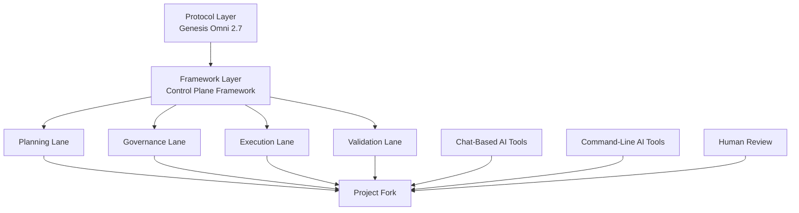

# Framework Diagram

## Interpretation

- The protocol layer defines posture and operating expectations.
- The framework layer provides reusable structure.
- The project fork is where product-specific work happens.
- Multiple AI tools may participate in the same project.
- Human review remains part of the control loop.
